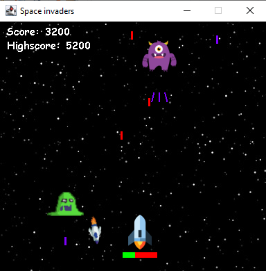
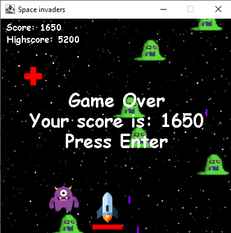

# space inv

An implementation of one version of the game Space Invaders using Java Swing library. 
Player rocket fights against two types of monsters, one firing one bullet at a time (killing which adds 250 to the score) and one firing 3 bullets at once (killing which adds 350 to the score) and one type of a missile which changes direction in order to hit the player what he should avoid. Killing the monster produces a short fade away animation. There are also health items which increase player's health when collected. 
